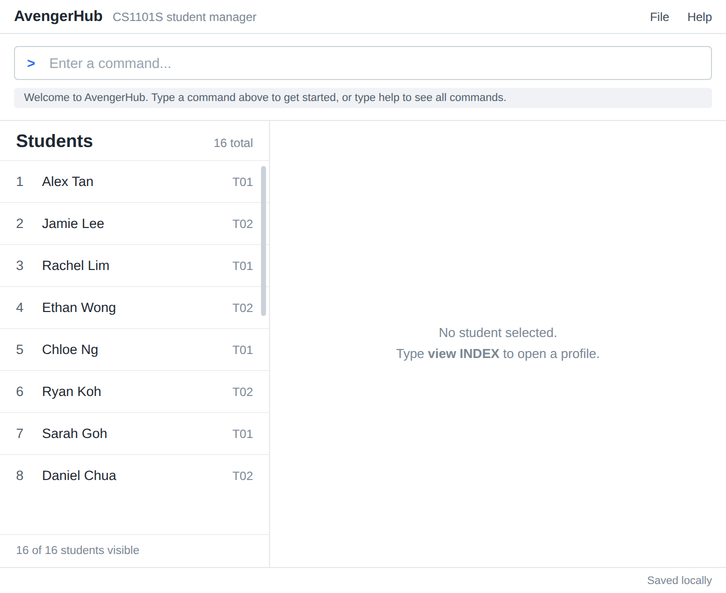

# AvengerHub

AvengerHub is a desktop address book tailored for CS1101S tutors. It combines
the speed of a command-line interface with the convenience of a graphical user
interface, helping tutors keep student details from different tutorial groups
organized in one place.

## Features

- Add, edit, and delete student contact records.
- Find students by name and view all saved records.
- Keep track of administrative tutor work, such as grading and attendance.
- Save data automatically between sessions.

## Documentation

- [User Guide](https://ay2627s1-cs2103t-f14a-1.github.io/tp/UserGuide.html)
- [Developer Guide](https://ay2627s1-cs2103t-f14a-1.github.io/tp/DeveloperGuide.html)

`AvengerHub` is named for its goal of consolidating a tutor's duties in one
place.

Made with ❤️ by the AY2627S1-CS2103T-F14a-1 team.

Acknowledgements
-
This project is based on the AddressBook-Level3 project created by the [SE-EDU initiative](https://se-education.org).
